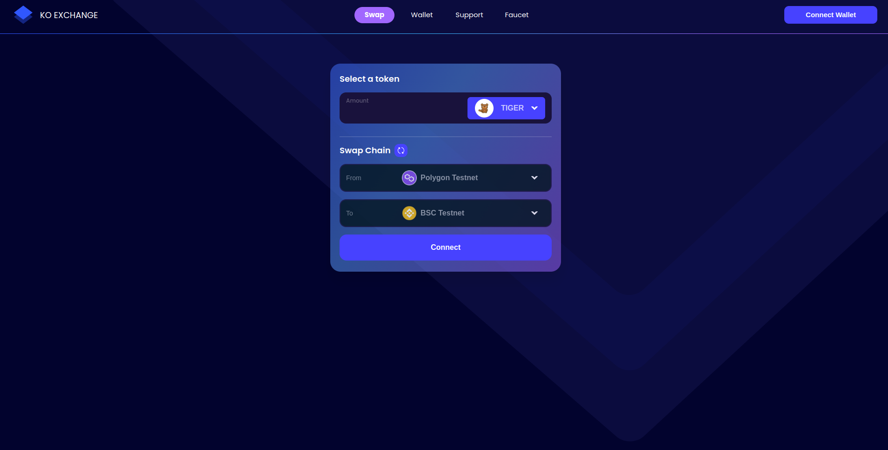
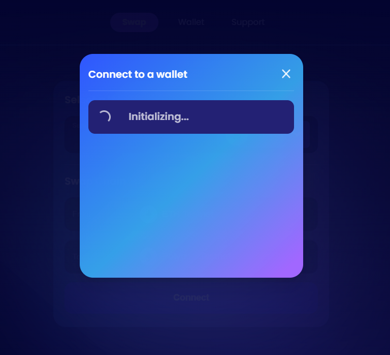

### Step 1

Click link: [https://app.ko.exchange](https://app.ko.exchange)

Click Connect Wallet button on top right corner

### Step 2

Connect to your wallet. We currently support Metamask and Coinbase.

### Step 3

Waiting for the wallet to connect.

### Step 4

You will receive a message about "Unsupported Network".

This is normal because we are using an ETH Testnet (KO Chain) that is controlled by Sisu, not the Ethereum Mainnet.

Click "x" on the top right corner.

### Step 5

Click "Switch to supported network" to switch to ETH Testnet (KO Chain)

Right now Metamask or your wallet will ask to allow to add the network

Please choose Approve

### Step 6

Allow this site to switch the network

Please choose "Switch Network"

### Step 7

Now you are already connected to the ETH Testnet (KO chain) on your wallet

Before you can transfer any tokens, you need to click “Give Permission”

Please click "Confirm"

### Note:

"A fee is associated with this request. You need to have a minimum of $0.27(0.000094 ETH) test token in your wallet in order to confirm"

This is only Test tokens, we will airdrop these Test tokens to our participants for gas fees.

### Import Token:

Sisu Network is using animal test tokens (Tiger, Monkey, Bunny,.. and so on)

We will then airdrop these test tokens to the testnet participants

You will need to import your Test token address into Metamask in order to see it

In Metamask, please choose: Import Custom Token, Paste the address of our test token

### Step 10:

After importing the Test token, you can now see the balance of your test token.

For example: 47 Tiger Token

You can now swap to different network

You can choose Wallet column to see your balance of your tokens

You can also switch back and forth different chain to see balance

### Swap chain

To swap back and forth between KO Chain and Mazze Chain, you can choose the icon next to "Swap Chain"

Please click "Switch network" to allow wallet to switch from Ko Chain (ETH Testnet) to Mazze Chain

