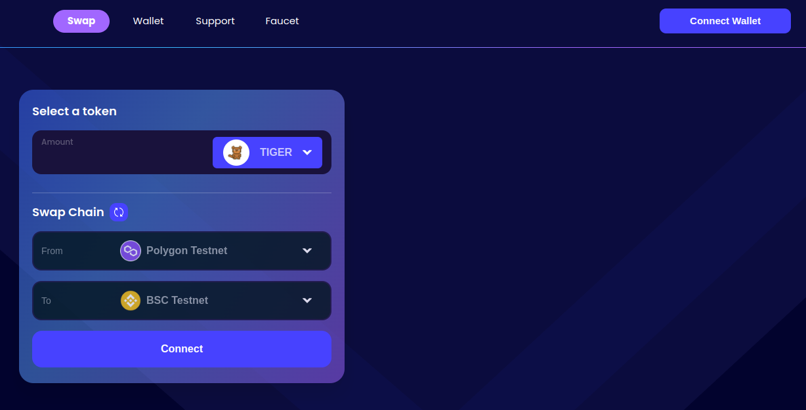
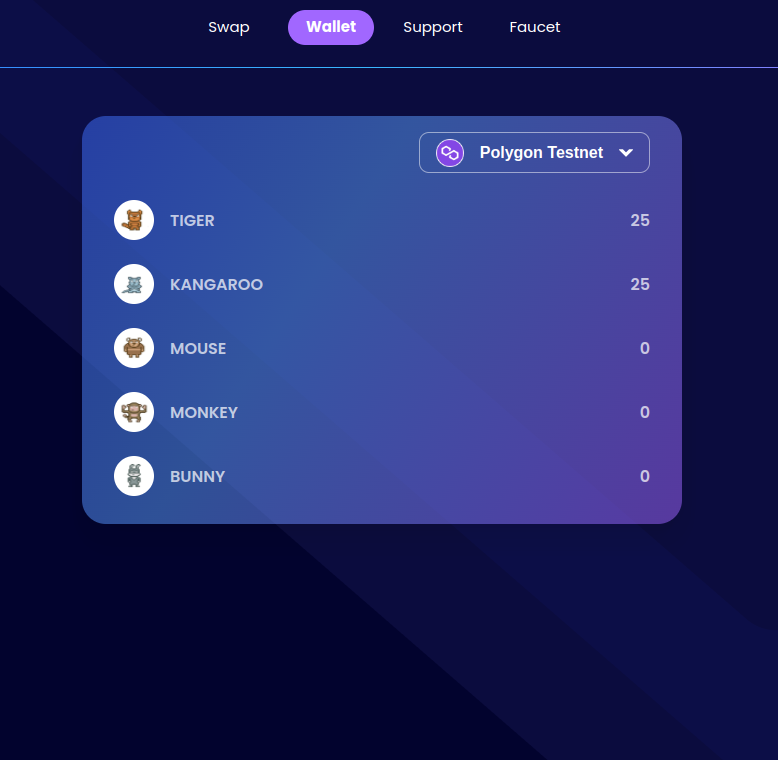

### Step 1

Click link: [https://app.ko.exchange](https://app.ko.exchange)

Click "Connect Wallet" button on the top right corner or the middle

### Step 2

Connect to your wallet. Depending on the source chain, there will be suitable wallets.

BSC Testnet, Fantom Testnet, Polygon Testnet, Avalanche Testnet will support Metamask and Coinbase wallet.

Cardano Testnet will support Nami and Flint wallet

### Step 3

Waiting for the wallet to connect.

### Step 4

If Metamask or Coinbase is connected and the button is "Switch to the correct chain", please press it and confirm the popup from your wallet. Because current chain in your wallet is different from the source chain.

If Nami or Flint is connected and the button is "Unsupported chain" please make sure the wallet has currently use testnet network, if not, please change it to testnet.

### Step 5

Now you are already connected to the source chain on your wallet.

Before you can transfer any tokens, you need to click "Give Permission" and confirm.

Please wait for a while until the transaction succeeds.

### Faucet

Sisu Network is using animal test tokens (TIGER, KANGAROO, MOUSE, MONKEY, BUNNY).
You can claim it here [https://faucet.ko.exchange](https://faucet.ko.exchange)

You can see your token balance in wallet tab.

After having some tokens, let’s swap now!

### Swap Chain

Make sure the current chain in wallet and source chain are the same. If not, it will show "Switch to the correct chain", please press and confirm.

1.  Swap between ETH based chains (BSC Testnet, Fantom Testnet, Polygon Testnet, Avalanche Tesnet)

Please enter a valid amount and press the "Swap" button

We provide links to your transaction after it succeeds.

In the source chain, the transaction hash will be available immediately so the link will take you to the transaction link.

But transaction hash in the destination chain will be available after a while, so the link will take you to the page that lists the token transfers.

Please wait and pay attention to the new "IN" row.

Or you can check token balance in [https://app.ko.exchange/wallet](https://app.ko.exchange/wallet)

2.  Swap between ETH based chain and Cardano testnet

Like swap between ETH based chains, but you should provide your recipient address which will receive a token (address format must be valid in the destination chain).

**Hint:** In Cardano chain, you can see the token balance, transaction in, transaction out in your wallet (such as Nami) a bit faster than cardano explorer.
